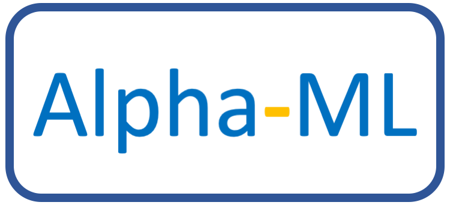

# Alpha-ML: Taking Human out of ML Applications.
[](https://travis-ci.org/keras-team/keras)
[](https://github.com/keras-team/keras/blob/master/LICENSE)



## You have just found Alpha-ML.

Alpha-ML is a high-level AutoML toolkit, written in Python.

Alpha-ML is compatible with: __Python 3.6__.


------------------


# Guiding principles

- __User friendliness.__ Alpha-ML needs few human assistance.

- __Easy extensibility.__ New ML algorithms are simple to add (as new classes and functions), and existing modules provide ample examples. To be able to easily create new modules allows for total expressiveness, making it suitable for advanced research.

- __Work with Python__. No separate models configuration files in a declarative format. Models are described in Python code, which is compact, easier to debug, and allows for ease of extensibility.

------------------
# Installation

Please install all dependencies manually with:

```curl https://github.com/thomas-young-2013/alpha-ml/blob/master/requirements.txt | xargs -n 1 -L 1 pip install```

Then install alpha-ml:

```python setup.py install```

Besides the listed requirements (see `requirements.txt`), the random forest
used in SMAC3 requires SWIG (>= 3.0).

```apt-get install build-essential swig gfortran```

------------------

# Examples

See examples/
  * 
------------------

## Development

- __Travis CI__ TODO.
- __Nose__ TODO.
- __Setuptools__ TODO.
